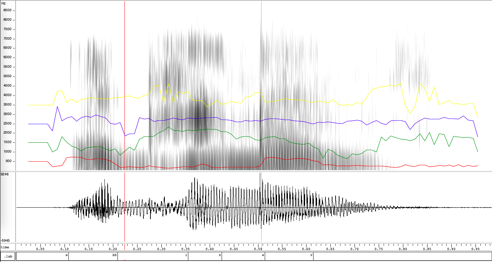

# Observations
The name "Abhinav" was recorded and analysed using WaveSurfer. The waveform, spectrogram and formant plots were generated. All these panes can be seen in Figure 1.

My observations on the above plots are:

* The vowels have significantly higher amplitude than the consonants. More specifically, we can rank the sounds in the name (schwa, /bh/, /i/, /n/, /v/) in order of the "loudness" as schwa ~ /i/ > /n/ > /bh/ ~ /v/. This makes sense as the loudest are the vowels (no constriction), followed by a nasal (constriction but open mouth), and lastly the stops and fricatives (closed mouth).
* The formants match approximately with expected F2 values of vowels. We can observe formants at 3.5kHz (/i/) and 1.5kHz (schwa). The F1 value of the latter, 500Hz, is also visible. However, the other formant, 2.5kHz (/e/) is not observed in the word.
* It is difficult to separate the consonants from the following vowels, *e.g.*, /bhi/ and /na/ are hard to break up. This could be because of the coarticulation process.
