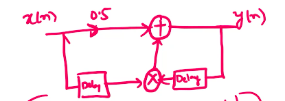

# Classification of Signals
A signal, as we have seen, is a function of one or more independent variables which carries some information.  
Categories of signals according to their dimensionality include 1-D (speech), 2-D (images) and 3-D (video).  

Signals classified according to the time characteristic are either analog or discrete.  

They may be also classified as deterministic (for example, $x(t) = e^{-at}$) or random (noise). A special subcategory of deterministic signals is periodic signals.  

Another classification of signals is as energy or power signals. Energy signals are those whose energy is finite, but power is infinite, and power signals are those whose energy is infinite but power is infinite.  
The energy of a signal here is
$$E = \sum_{n=-\infty}^\infty |x(n)|^2$$
in the discrete domain, and
$$E = \int_{-\infty}^\infty|x(t)|^2dt$$
in the continuous domain.  
The corresponding expressions for the power of a signal are
$$P = \lim_{N\to\infty}\frac1{2N+1}\sum_{n=-N}^N|x(n)|^2$$
and
$$P = \lim_{T\to\infty}\int_{\langle T \rangle}|x(t)|^2 dt.$$

We can also categorise signals as even or odd; even signals are those for which $x(n) = x(-n)$, while odd signals those for which $x(n) = -x(-n)$.

# Discrete Signals
There are two notations for discrete signals: the list notation and the graph notation.  

Two important discrete signals are the impulse signal $\delta(n)$, defined as
$$\delta(n) = \begin{cases}
1 & n = 0 \\
0 & n \neq 0, \end{cases}$$
and the unit step signal $u(n)$, defined as
$$u(n) = \begin{cases}
1 & n \geq 0 \\
0 & n < 0. \end{cases}$$

Some operations on signals are amplitude scaling $y(n) = ax(n)$, amplitude shifting $y(n) = x(n) +b$, time shifting $y(n) = x(n-k)$, and time scaling $y(n) = x(an)$.

# Systems
We will now consider different types of systems, focusing on discrete-time systems.  

A system is defined as an algorithm that, according to some well-defined rule, acts on a signal (called the input signal or *excitation*), to produce another signal (called the output signal or *response*). The notation for this is
$$x \xrightarrow{T} y,$$
or
$$y = T(x),$$
where $T$ is the algorithm, $x$ the input signal and $y$ the output signal.  
A common example of a continuous-time system is a differential equation, and analogously, for a discrete-time system we have difference equations.  

For instance, a discrete system may be given by
$$y(n) = x(n) + x(n-1) + y(n-1).$$
Such discrete systems can be implemented in hardware using only three components: an adder, a multiplier and a delay element. This is as opposed to the complexity inherent in the design of continuous systems, which need several kinds of circuit elements.

## Classification of Systems
Systems can be classified along five directions: causal vs. non-causal, time-invariant vs. time-variant, linear vs. non-linear, invertible vs. non-invertible and stable vs. unstable.  
These classifications are important as we prefer systems which are causal, time-invariant, invertible and stable.  

Causal systems are those whose outputs depend only on present inputs and past inputs or outputs. For example,
$$y(n) = x(n-1) + y(n-3) + 2y(n-1)$$
and
$$y(n) = x(n+2) + y(n+2)$$
are causal (substituting $n+2 = m$ in the second equation), while
$$y(n) = x(n+1) + y(n-2)$$
is non-causal.

Time-invariance means that if the input is delayed, the output should be equally delayed. For example, if 
$$x(n) \xrightarrow{T} y(n),$$
and
$$x(n-k) \xrightarrow{T} y'(n),$$
then
$$y'(n) = y(n-k)$$
should hold for $T$ to be time-invariant. An example of a time-invariant system is
$$y(n) = x(n-1) + x(n) + x(n+1),$$
and an example of a time-variant system is
$$y(n) = x(2n).$$

An invertible system is a system $T$ such that we can design a system $T^{-1}$ which takes the output of $T$ to the input of $T$.  

A stable system has as a condition "bounded input, bounded output", or BIBO. In other words,
$$|x(n)| \leq M_x < \infty \implies |y(n)| \leq M_y < \infty.$$

Linearity means that a system should follow homogeneity and superposition. Mathematically,
$$a_1 x_1(n) + a_2 x_2(n) \xrightarrow{T} a_1 y_1(n) + a_2 y_2(n),$$
if
$$\begin{split}
x_1 &\xrightarrow{T} y_1 \\
x_2 &\xrightarrow{T} y_2. \end{split}$$
