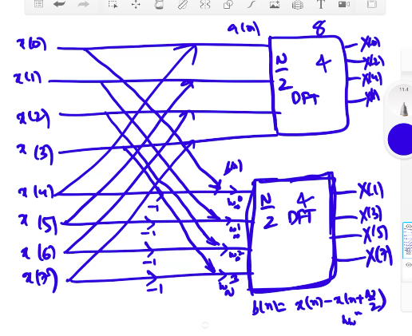
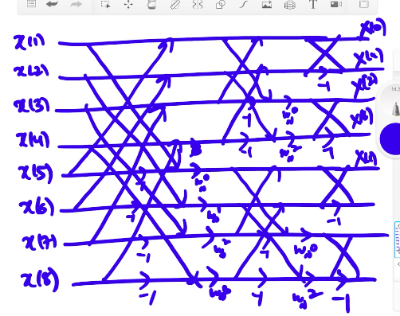
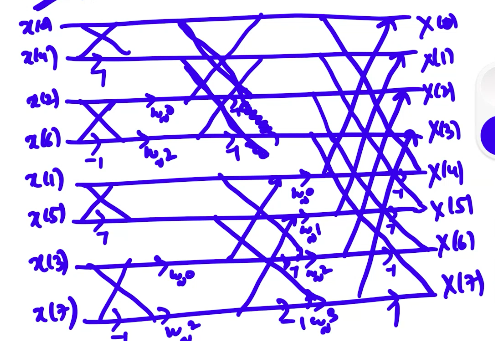

# Fast Fourier Transform (contd.)
We have seen that the discrete Fourier transform is calculated as
$$X(k) = \sum_{n=0}^{N-1} x(n) w_N^{kn},$$
where $w_N$, the *twiddle factor*, is
$$e^{-j \frac{2\pi}N}.$$

The symmetry of the twiddle factor, however, enables us to calculate the $N$-point DFT using the $\frac{N}2$-point DFT. Note that this means that we calculate only DFTs where $N$ is a power of 2.  

There are two types of FFT: decimation in frequency and decimation in time.

## Decimation in Frequency and Time
### Decimation in Frequency (DIF)
We have
$$X(k) = \sum_{n=0}^{N-1} x(n) w_N^{kn}.$$

We can rewrite
$$\begin{split}
X(k) &= \sum_{n=0}^{\frac{N}2-1} x(n) w_N^{kn} + \sum_{n=\frac{N}2}^{N-1} x(n) w_N{kn} \\
&= \sum_{n=0}^{\frac{N}2-1} x(n)w_N^{kn} + \sum_{n=0}^{\frac{N}2-1} x(n+\frac{N}2) w_N^{k\left(n+\frac{N}2\right)} \\
&= \sum_{n=0}^{\frac{N}2-1} x(n)w_N^{kn} + w_N^{k\frac{N}2} \sum_{n=0}^{\frac{N}2-1} x(n+\frac{N}2) w_N^{kn} \\
&= \sum_{n=0}^{\frac{N}2-1} x(n)w_N^{kn} + e^{-j\pi k} \sum_{n=0}^{\frac{N}2-1} x(n+\frac{N}2) w_N^{kn} \\
&= \sum_{n=0}^{\frac{N}2-1} x(n)w_N^{kn} + (-1)^k \sum_{n=0}^{\frac{N}2-1} x(n+\frac{N}2) w_N^{kn} \\
&= \sum_{n=0}^{\frac{N}2-1} \left[x(n) + (-1)^k x\left(n + \frac{N}2\right) \right] w_N^{kn}. \end{split}$$

Here, $k$ varies from 0 to $N-1$. We can now divide it into even and odd terms to get
$$\begin{split}
X(2m) &= \sum_{n=0}^{\frac{N}2-1} \left[x(n) + x\left(n+\frac{N}2\right)\right] w_N^{2mn} \\
&= \sum_{n=0}^{\frac{N}2-1} a(n) w_{\frac{N}2}^{mn}, \end{split}$$
where $a(n) = x(n) + x\left(n+\frac{N}2\right)$. Similarly,
$$X(2m+1) = \sum_{n=0}^{\frac{N}2-1} b(n) w_N^n w_{\frac{N}2}^{mn},$$
where $b(n) = x(n) - x\left(n+\frac{N}2\right)$.  

These expressions are simply the $\frac{N}2$-point DFTs of $a(n)$ and $b(n)w_N^n$.

The term *decimation of frequency* indicates that the output is not in order, *i.e.*, we find the odd terms and the even terms separately. The output is obtained in *bit reversal order*, which means that the reversed binary representations of the positions are in order – $[0,4,2,6,1,5,3,7]$.

### Decimation in Time (DIT)
Again, we have
$$X(k) = \sum_{n=0}^{N-1} x(n) w_N^{kn}.$$

This time, however, we rewrite it as
$$X(k) = \sum_{m=0}^{\frac{N}2-1} x(2m)w_N^{2mk} + \sum_{m=0}^{\frac{N}2-1} x(2m+1)w_N^{(2m+1)k}$$
and use this to calculate $X(k)$.  

In this case, the input is taken in the bit reversal order, and the output is obtained in the normal order.

## Inverse DFT Using FFT
We know that the IDFT is given by
$$x(n) = \frac1N \sum_{n=0}^{N-1} X(k) w_N^{*kn}.$$

Thus the IDFT can be calculated in the same way, using DFT, but taking care to normalise by division by $N$ and using $w_N^*$ instead of $w_N$.